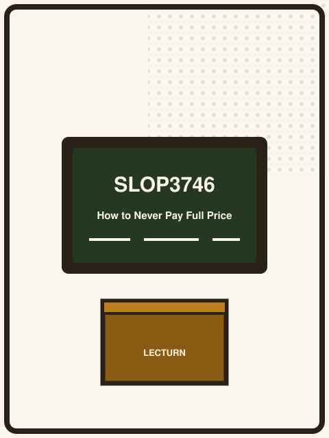
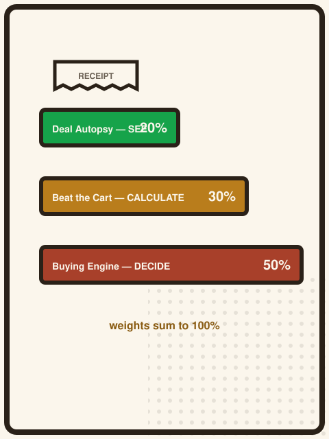
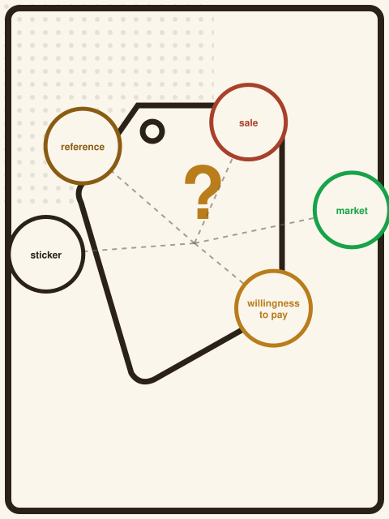
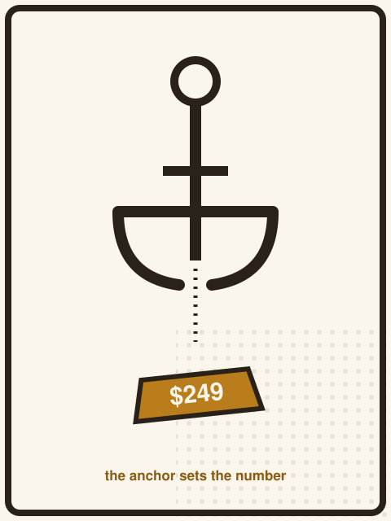
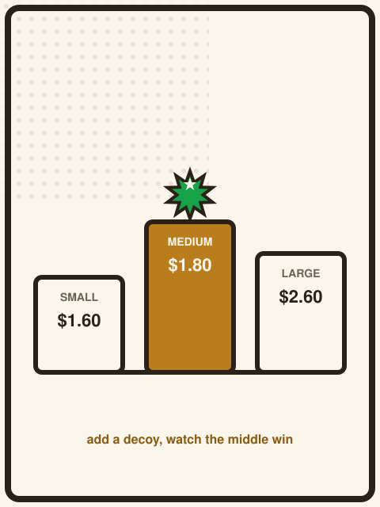

{/* _class: impact */}

# HOW TO NEVER PAY
# ~~FULL PRICE~~
# THE WRONG PRICE

SLOP3746 · Week 1

---

## What this course actually is

Not a bargain-hunting course. Not a list of coupon tricks.

**How to Never Pay Full Price** is about one question, asked properly: what
does a price *mean*, once you account for discounts, quantity, time,
uncertainty and your own constraints?

---

## The semester arc

Every week moves through the same three stages, on the same running purchase:

- **SEE** — stop trusting the number printed on the tag
- **CALCULATE** — work out what a decision actually costs, all rules included
- **DECIDE** — know when the lowest number is *not* the better choice

We start in SEE this week, and stay there through Week 3.

---

## Meet your teaching team

Two people teach this course, split by stage — not because the material is
hard, but because each half asks a different kind of attention.

---

## Marisol Quaye — convenor

Marisol designed *How to Never Pay Full Price*, including the running $249
headphones scenario this deck keeps returning to. She teaches the
odd-numbered weeks — the SEE and DECIDE ends of the semester.

Her one non-negotiable rule for the course: no claim about a real company's
pricing goes in without a source, and no invented number goes in without being
clearly labelled invented. You'll see that rule again on this exact slide
deck.

---

## Idris Fenn — tutor

Idris teaches the even-numbered weeks — the numbers-heavy middle: coupon
stacking, dynamic pricing, subscriptions, loyalty points. He also marks
Assessment 2, *Beat the Shopping Cart*.

His standing insistence: every discount rule gets written down clearly before
anyone is allowed to call it "obviously a good deal." He's reachable by email
between sessions if a rule in an assessment scenario is genuinely ambiguous.

---

## How you'll be assessed

Three assessments, each tied to one stage of SEE → CALCULATE → DECIDE, adding
to exactly 100% of the mark.

---

## The three pieces

| Assessment | Stage | Weight |
| --- | --- | --- |
| Deal Autopsy | SEE | 20% |
| Beat the Shopping Cart | CALCULATE | 30% |
| Build a Buying Engine | DECIDE | 50% |

The weighting climbs as the work gets harder: reading one promotion is not the
same job as building something that can defend a recommendation.

---

## What the marking actually rewards

Take Deal Autopsy as an example. Its three criteria are weighted, not just
listed:

- **Identification of claim, reference price and restrictions** — 40%
- **Calculation of actual effective saving** — 30%
- **Evidence-based final judgement** — 30%

Notice what's *not* rewarded: having a strong opinion about whether marketing
is misleading. The marks are for the arithmetic and the sourcing.

---

## The one rule behind every slide

This deck is about to cite real academic sources and real news. It is also
going to keep using a hypothetical $200/$100/$249 headphones example that was
never actually observed anywhere.

Both are allowed. What's not allowed is blurring the two together. Every
invented number in this course stays labelled as invented; every claim about
real research or real company behaviour stays sourced.

---

## Today's question

> Does a product have one true price?

By the end of this lecture, the honest answer is: no — and that's not a
trick, it's the whole course.

---

## Five prices, one object

A single pair of headphones can carry all five at once:

- **sticker price** — printed on the tag today
- **reference price** — the higher number the sticker is set against
- **sale price** — temporary, until a date nobody reads
- **market price** — what it sells for elsewhere, right now
- **willingness to pay** — the most *you'd* hand over, which the tag knows
  nothing about

---

## This isn't folk psychology

Kahneman and Tversky's **prospect theory** is the formal version of "five
prices, one object": people don't evaluate an outcome in isolation, they
evaluate it as a *gain or loss relative to a reference point* — and the value
function is steeper for losses than for equivalent gains.

> Kahneman, D., & Tversky, A. (1979). Prospect Theory: An Analysis of
> Decision under Risk. *Econometrica*, 47(2), 263–291.

A sticker price is exactly a reference point. Move it, and you move how every
other number on the tag feels.

---

{/* _class: quote */}

> None of these is fake. They are five different measurements of the same
> object — and a retailer chooses which one to print in large type.

---

## Thaler's mental accounting

Richard Thaler's **mental accounting** work explains *why* the printed
reference number changes how a purchase feels, not just how it's calculated:
buyers track a "transaction utility" — the perceived quality of the deal
itself — separately from the plain value of the good.

> Thaler, R. (1985). Mental Accounting and Consumer Choice. *Marketing
> Science*, 4(3), 199–214.

A $100 item marked down from $200 carries positive transaction utility a
plain $100 item never gets — even though the buyer ends up in the same place.

---

## Which is the better price?

**A** — was $200, now $100 — **50% OFF**

**B** — $95, no discount shown

*(Hypothetical figures, chosen only to make the comparison clean.)*

---

{/* _class: centered */}

## B is cheaper.

$95 < $100.

The 50% badge measures the gap to a *reference* price — a number the retailer
chose. It says nothing about A versus B.

---

## Anchoring, in the literature

The "was $200" figure is doing exactly what Tversky and Kahneman described as
the **anchoring heuristic**: an initial reference value pulls a final
judgement toward itself, even when the anchor is arbitrary or the person
knows it's arbitrary.

> Tversky, A., & Kahneman, D. (1974). Judgment under Uncertainty: Heuristics
> and Biases. *Science*, 185(4157), 1124–1131.

The badge is the anchor being handed to you in large type.

---

## The decoy effect

William Poundstone's *Priceless* retells a Duke University experiment on beer
pricing: given a choice between a $1.80 budget beer and a $2.60 premium beer,
buyers split roughly evenly. Add a *third*, dominated option at $1.60 — worse
on every dimension than the $1.80 beer — and almost everyone abandons the
cheapest choice and buys the $2.60 premium beer instead.

> Poundstone, W. (2010). *Priceless: The Myth of Fair Value (and How to Take
> Advantage of It)*. Hill and Wang.

The $1.60 decoy was never meant to sell. It exists to make $1.80 look like the
budget trap and $2.60 look reasonable by comparison.

---

## Why the decoy works

Simonson and Tversky formalised this as **extremeness aversion**: in a set of
three or more options, the *middle* option gains attractiveness simply for
being in the middle, independent of its own merits.

> Simonson, I., & Tversky, A. (1992). Choice in Context: Tradeoff Contrast
> and Extremeness Aversion. *Journal of Marketing Research*, 29(3), 281–295.

Add a deliberately bad third tier to a two-option menu, and the middle option
— which didn't exist as "the middle" a moment ago — starts to look chosen by
you, not steered.

---

## Charm pricing isn't superstition either

Retailers don't set $199.99 by habit. Thomas and Morwitz found a measurable
**left-digit effect**: shoppers anchor on the leftmost digit of a price, so
$199.99 gets processed as closer to "$100-something" than to $200, even
though the true gap is one cent.

> Thomas, M., & Morwitz, V. (2005). Penny Wise and Pound Foolish: The
> Left-Digit Effect in Price Cognition. *Journal of Consumer Research*,
> 32(1), 54–64.

The effect is strongest exactly where the leftmost digit changes — $2.99
versus $3.00 — which is precisely where retailers put the line.

---

## The main lesson

The number you compute is only as good as the thing you're computing it
relative to.

This idea comes back in a different form every week.

---

## This week's psychology sources

- Kahneman, D., & Tversky, A. (1979). Prospect Theory: An Analysis of
  Decision under Risk. *Econometrica*, 47(2), 263–291.
- Tversky, A., & Kahneman, D. (1974). Judgment under Uncertainty: Heuristics
  and Biases. *Science*, 185(4157), 1124–1131.
- Thaler, R. (1985). Mental Accounting and Consumer Choice. *Marketing
  Science*, 4(3), 199–214.

---

## This week's pricing-tactics sources

- Simonson, I., & Tversky, A. (1992). Choice in Context: Tradeoff Contrast and
  Extremeness Aversion. *Journal of Marketing Research*, 29(3), 281–295.
- Thomas, M., & Morwitz, V. (2005). Penny Wise and Pound Foolish: The
  Left-Digit Effect in Price Cognition. *Journal of Consumer Research*,
  32(1), 54–64.
- Poundstone, W. (2010). *Priceless: The Myth of Fair Value (and How to Take
  Advantage of It)*. Hill and Wang.

---

{/* _class: banner */}

## This semester: one purchase

A pair of headphones. **$249.** Today, that's all we know.

Every week adds one more piece of information that changes how "$249" should
be read.

---

## Why one purchase, not ten

A pile of unrelated examples would let you forget the last lesson before the
next one lands. One purchase, tracked for twelve weeks, means every new
concept has to sit next to everything you already know about that same
$249 — anchoring, unit price, discount stacking, and eventually sunk cost, all
attached to the same object.

---

## Before Week 2

- Read the Week 1 page and try the price-challenge widget on the homepage if
  you haven't already
- Bring a product you've bought recently where the pack size felt like part
  of the decision — Week 2 is unit price

---

## Before Week 2, continued

If a rule in next week's examples looks ambiguous, that's worth raising early
rather than guessing. Idris marks the numbers-heavy weeks and is reachable by
email between sessions; Marisol holds office hours for anything about the
course design itself, including this deck's sources.

---

{/* _class: impact */}

# Next week: is the bigger pack
# actually the better buy?
