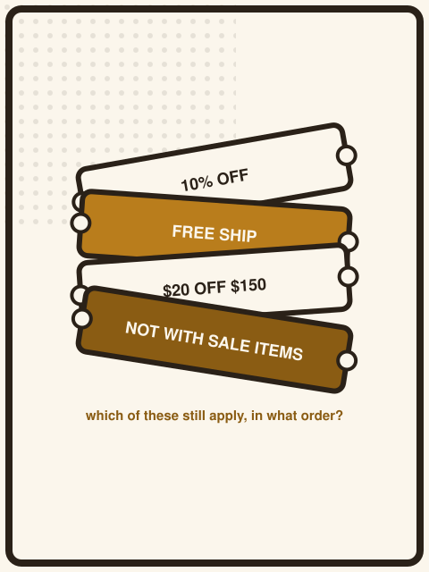
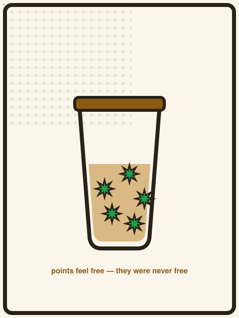
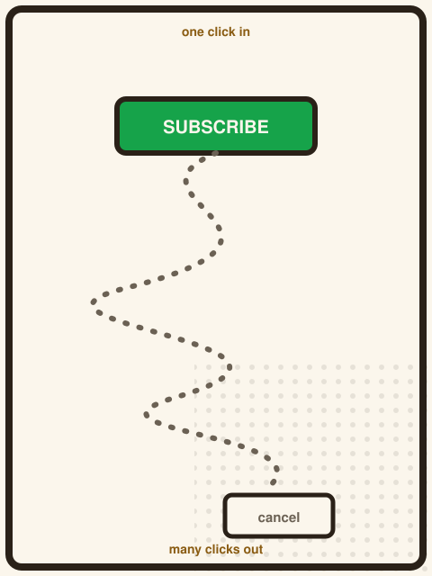
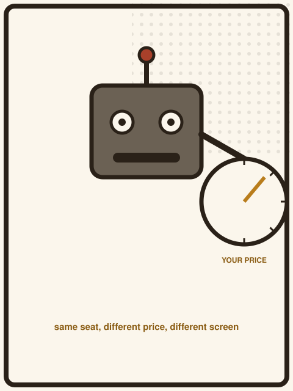

{/* _class: impact */}

# LECTURE 3
# COUPONS ARE
# ALGORITHMS

SLOP3746 · Week 4

---

## Today's question

> When discounts have rules, how should they be combined?

By the end of this lecture: by treating each discount as a rule to work
through, and checking the final total, not the badge.

---

## Why coupon rules are algorithms

A single reference price (Week 3) is one comparison. A real cart usually has
several discount rules active at once, each with its own condition.

That's not a pile of marketing tricks. It's a small program:

- a set of **rules**
- each with a **condition**
- evaluated against the **current cart**
- in some **order**, which itself matters

---

## Discount amount vs effective saving

A coupon's headline number and the money it actually saves are not always
the same number:

- "$30 off" is fixed, regardless of what you buy
- "20% off" depends entirely on what it's applied to
- "20% off, excludes sale items" depends on what's *left* after exclusions

The badge tells you the rule. It doesn't tell you the result. You have to
work out the result.

---

## Thresholds

**"$10 off orders over $50."**

- spend $49 → the rule doesn't fire → $0 off
- spend $50 → the rule fires → $10 off
- spend $51 → the rule fires → $10 off, and you paid $1 for headroom you
  didn't need

A threshold changes suddenly, not gradually. Being just under it and just
over it can produce very different outcomes for a tiny difference in spend.

---

## Exclusions

**"20% off everything — excludes sale items and gift cards."**

The percentage is computed against the **applicable subtotal**, not the
cart subtotal. If half your cart is already-discounted items, the coupon
is worth roughly half of what its headline number suggests.

Read the exclusion list before you read the percentage.

---



## Stacking rules

Can two discounts apply to the same order? It depends entirely on rules you
can't see from the badges:

- some platforms let a threshold coupon and a category coupon combine
- many explicitly forbid combining any two coupon codes
- some silently apply only the larger of the two, and say nothing about it

There is no universal answer. There is only the actual rule text.

---

{/* _class: quote */}

> Read the rule like instructions you have to follow — not like an
> advertisement.

---

## Bundles

A bundle is a stacking rule wearing a single price tag.

**"Add the case for $20 more."**

This is not "a discount". It is a coupon on the case, worth exactly what
the case is worth to you — and only a good deal if you wanted the case at
all.

---

## Free shipping thresholds

**"Free shipping over $75."**

This works like a spend threshold, except the "discount" is a fee waiver
rather than a dollar amount. The same trap applies: adding a
$10 item to clear a $75 threshold only makes sense if that item is worth
more to you than the shipping fee it waives.

---

## Cart state as input

Every rule above reads from the same thing: the current cart. Treat that
cart as a small set of facts:

- **subtotal** — total before any rule applies
- **categories** — which items are excluded, which aren't
- **quantities** — thresholds care about totals, not item counts
- **applied rules so far** — because stacking rules depend on order

A coupon rule uses these facts, not just the badge printed on it.

---

## Coupon rules as steps

In plain terms, every rule on the last few slides has the same shape:

```
rule(cart) → discount, or refusal
```

- **input:** the cart facts above
- **condition:** the rule's threshold, exclusion, or stacking clause
- **output:** either a discount amount, or nothing at all

Solving a cart means finding the version of the cart that gives the best
final total — not chasing one impressive-looking rule on its own.

---

{/* _class: centered */}

## A coupon system is a small program.

Reading it correctly beats guessing from the badge every time.

---

## Worked example: simple cart

Hypothetical cart: two items, $30 and $45. One rule: "$10 off orders over
$50."

- subtotal: $75 → over the $50 threshold
- discount: $10
- total: **$65**

No trap here — the rule fires cleanly and the discount is real. Not every
example is this friendly.

---

## Worked example: the threshold trap

Hypothetical cart: one item, $42. Same rule: "$10 off orders over $50."

- subtotal $42 is under $50 → rule doesn't fire
- add an $9 item purely to clear the threshold: subtotal $51 → discount
  $10 → total $41
- **but** you now own a $9 item you didn't want

Net spend on wanted items: $41 + $9 unwanted = **effectively $50** for a
$42 want. The "discount" made the purchase more expensive.

---

## Worked example: a bundle that isn't actually cheaper

Hypothetical bundle: headphones $249 alone, or "headphones + case" for
$269.

- buying separately: $249 + case at $25 elsewhere = $274
- the bundle: $269 → looks like a $5 saving

But only if the case is worth $20 to you. If it isn't, the honest
comparison is $249 (what you wanted) vs $269 (what you paid) — a $20 loss
dressed as a discount.

---

## The $249 headphones, with accessories

Hypothetical scenario: a $30-off coupon requires a $260 minimum spend. A
carrying case costs $25.

- buy the case to clear the threshold: $249 + $25 − $30 = **$244**
- five dollars cheaper than $249 — and a case sitting unused in a drawer

Whether that's a win depends entirely on whether the case was ever wanted.
The coupon math is correct either way; the *decision* isn't.

---

## Why "spend more to save more" can be false

Every example on the last three slides used the same headline framing —
"spend more, unlock a bigger discount" — and in at least one of them, the
net effect was a **more expensive** purchase.

The rule combines correctly. The advice built on top of it doesn't follow
automatically. That gap is exactly what this course asks you to check,
every time, rather than assume.

---

{/* _class: quote */}

> Buying unnecessary items purely to unlock a larger advertised discount
> should not automatically count as "saving money."

---

## How Assessment 2 uses this reasoning

**Beat the Shopping Cart** hands you a constrained scenario with several
of these rules active at once — thresholds, exclusions, stacking, loyalty
rewards — and asks for a clear strategy, not a guess.

The marking focuses on the rules and the real final cost. An unnecessary
purchase that technically unlocks a bigger badge is exactly what is not
rewarded.

---

## In-class challenge

Hypothetical cart, three rules active:

1. "$15 off orders over $80"
2. "Free shipping over $60" (shipping otherwise $8)
3. "Buy 2 accessories, get the cheaper one 50% off"

Items available: headphones $249, case $25, cable $12, cleaning kit $9.

**Question:** what's the cheapest way to get the headphones home, and does
satisfying any rule cost more than it saves?

---

## Solution walkthrough

- headphones alone: $249 + $8 shipping = $257
- headphones + case ($25): subtotal $274, over both thresholds → −$15,
  free shipping → **$259** — worse than buying nothing extra
- headphones + case + cable: subtotal $286, same discounts, plus rule 3
  makes the cable 50% off (−$6) → **$253**, and now you own two
  accessories you'd have bought anyway

The right answer depends on whether the case and cable were wanted at all
— the arithmetic alone can't decide that for you.

---

## Summary: rules, not tricks

- every discount rule has inputs: cart in, discount or refusal out
- read the actual condition, not the badge
- compute the applicable subtotal, not the full subtotal
- a rule that requires spending more only helps if the extra spend was
  wanted on its own terms

---

## Coupons aren't the only rule-based price

Coupons are the easiest rule to see, because the rule is printed on the
badge. The same "cart in, discount or refusal out" logic runs underneath
loyalty points, subscriptions and dynamic pricing — usually with the rule
kept less visible, not more.

---



## Loyalty points are a rule, not a gift

A points program is a coupon with a delay: "spend now, get a discount rule
that only fires later, in a currency the retailer controls." The retailer
sets the exchange rate, the expiry, and which purchases even qualify — all
after you've already paid.

Treat accumulated points the same way you'd treat any other conditional
discount: worth exactly what you can actually redeem, not their sticker
value.

---



## Subscriptions: easy to start, a maze to leave

Many subscription flows make joining a single click and cancelling a
multi-step process — a real, regulator-documented pattern, not a hypothetical
one:

> The U.S. Federal Trade Commission finalised its "click to cancel" rule
> (16 CFR Part 425) on 16 October 2024, requiring cancellation to be at least
> as easy as sign-up. A federal appeals court vacated the rule in 2025 on
> procedural grounds, so it is not currently in force — but the underlying
> pattern it targeted is well documented.

The rule's legal status can change; the underlying cart-exit-friction pattern
is the thing to keep watching for regardless.

---

## Drip pricing and "junk fees"

The exclusion and threshold rules from earlier in this lecture have a fee
version: charges that appear only at checkout, after the headline price has
already anchored you.

> The FTC's "Rule on Unfair or Deceptive Fees" was finalised in December 2024
> (a 4–1 commission vote) and required total price disclosure, including
> mandatory fees, up front; enforcement began 12 May 2025.

Same lesson as a coupon exclusion: read the applicable total, not the
headline number, before you decide the badge is honest.

---



## When the "rule" adjusts itself

Every rule so far is fixed in advance. Dynamic and personalised pricing lets
the retailer's system adjust the rule per customer, per moment:

> In 2025, Delta Air Lines expanded AI-driven fare pricing built with the
> startup Fetcherr, moving from roughly 3% of domestic pricing toward a
> stated goal of 20% of flights by the end of 2025 — prompting public and
> lawmaker criticism that the practice could amount to personalised,
> less transparent pricing. Separately, Australia's ACCC named algorithmic
> pricing transparency a priority area for 2025.

The coupon-reading habit from this lecture still applies: the "rule" still
takes cart-like inputs and returns a price, it's just that you can no longer
see the rule, or confirm it's the same one another shopper was shown.

---

{/* _class: impact */}

# Next week: is $249
# even the right number
# to focus on?
