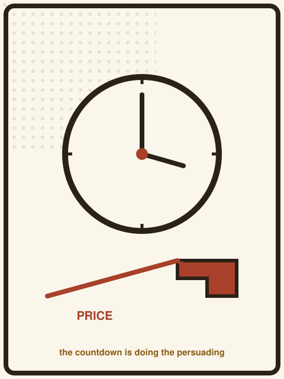
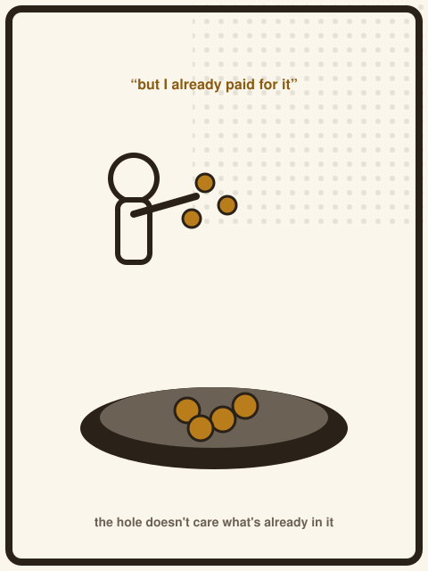
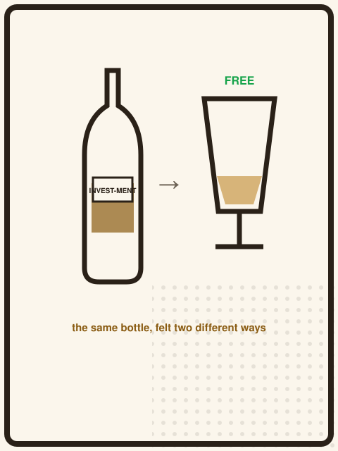
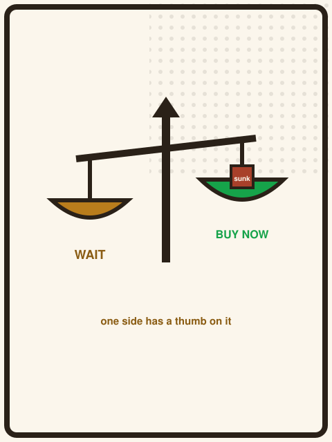

{/* _class: impact */}

# LECTURE 4
# SHOULD YOU
# WAIT?

SLOP3746 · Week 10

---

## Today's question

> When does it make sense to wait for a better price?

By the end of this lecture: when the expected saving is bigger than the
costs of waiting, using a rule you set before you know the outcome.

---

## Waiting is a bet

Buying now locks in a known price. Waiting trades that certainty for a
chance at a better one. That's a bet, in the exact sense a bet always is:
a range of outcomes, none of them guaranteed, some of them worse than
just paying today.

Treating it as anything other than a bet — a guarantee, a trick, a
certainty — is where this reasoning goes wrong.

---

## Why future price is uncertain

Week 5 showed price moving over time. Week 6 showed it responding to
context. Put together: next month's price for this item is not a fixed
fact waiting to be discovered. It depends on demand, stock, season, and
decisions nobody's made yet.

This course does not claim to predict it. It claims something simpler and
more useful: you can make a reasonable estimate.

---

{/* _class: quote */}

> You cannot know the future price. You can only estimate it. Those are
> different claims.

---

## Expected value, in plain language

You don't get "the discount, if it happens." You get the discount,
discounted *again* by how likely it is to happen at all.

A guaranteed small saving and an unlikely large one can be worth exactly
the same amount — or wildly different amounts — and you can't tell which
without doing the multiplication.

---

## The formula

`expected saving = probability(better deal) × size of that deal`

- a 10% chance of a $100 saving → expected saving **$10**
- a 50% chance of a $30 saving → expected saving **$15**

The second bet sounds far less exciting and is worth more.

---

## Stock-out risk

Waiting risks the item disappearing entirely — this exact model
discontinued, sold out, or replaced by a new version at a higher price
before any sale appears.

A saving you never get to collect is worth exactly nothing, no matter how
large the discount would have been.

---

## Urgency cost

If the item is needed by a fixed date — a gift, a trip, a broken pair
that needs replacing now — the window to wait may be shorter than the
window a "maybe" discount needs to arrive in.

Urgency doesn't change the probability of a sale. It changes how much of
that probability you're actually allowed to use.

---

## The value of having it now

A want satisfied today is not interchangeable with the same want satisfied
in six weeks, independent of price. Two headphones at the same price,
delivered on different days, are not the same purchase to someone who
wants to use them tomorrow.

This isn't sentiment. It's a real input the expected-value formula above
doesn't include on its own.

---

## What waiting costs in attention

Waiting isn't passive. Watching for a sale — checking prices, tracking a
listing, comparing near-identical deals — takes attention, and attention
spent watching is attention not spent elsewhere.

Week 11 turns this into a number. For now: waiting has a cost even when
no money visibly changes hands during it.

---

## Worked example: the headphones at $249

The running scenario, restated: the headphones are $249 today, with no
sale currently active. That's the certain option — buy now, done, $249.

Everything on the next few slides is about what it would take to make
waiting the better bet instead.

---

## A hypothetical possible sale to $199

Hypothetically: this model has, in past years, been discounted to around
$199 during a known annual sale event roughly six weeks away.

This is not a promise, and it is not evidence about any real retailer's
future pricing — it's the kind of estimate a buyer can reasonably form
and should explicitly label as a guess, not a fact.

---

## Probability of the sale

Suppose, hypothetically, the buyer estimates a **40% chance** the sale
includes this exact model at that price this year — based on it happening
in two of the last five comparable events they remember.

That's a rough, self-reported estimate, not a statistic. It's still
better than pretending no probability exists at all.

---

## Expected saving, calculated

- possible saving: $249 − $199 = **$50**
- probability of getting it: **40%**
- expected saving: 0.4 × $50 = **$20**

Twenty dollars, not fifty. The $50 headline number is what you'd get *if*
the sale happens — the $20 is what waiting is actually worth, on average,
across every version of how this could go.

---

## When expected saving is not enough

$20 of expected saving has to be weighed against six weeks of stock-out
risk, urgency, the value of having the item now, and the attention cost
of watching for the sale.

If any of those costs, honestly estimated, exceed $20, waiting is the
worse bet — even though the $50-if-it-happens number is real and the 40%
estimate is reasonable.

---

## Risk tolerance

Two buyers can face the identical $20 expected saving and reasonably
disagree about waiting: one is comfortable with a 60% chance of getting
nothing extra, the other isn't. Expected value tells you the average
outcome across many repeated bets — it doesn't tell you how much one buyer
should mind the spread of possible outcomes.

Risk tolerance is a stated assumption, not something the formula supplies.

---

## Comparison with Week 11's time cost

Week 11 adds a second bet-cost on top of this one: the time actually
spent watching for the sale, priced at whatever the buyer's hour is worth.
Add the two together — expected saving from waiting, minus urgency and
stock-out risk, minus time cost — and you get a single number instead of
two separate vibes.

---

## How this feeds Assessment 3

**Build a Buying Engine** takes exactly these inputs — current price,
possible discount, probability, urgency, time cost — and asks for a
system that reaches BUY NOW, WAIT, or another recommendation and can
*explain* why, rather than outputting a number with no reasoning attached.

---

## Decision threshold: buy now vs wait

A simple clear rule: wait only if

`expected saving > stock-out risk + urgency cost + attention cost`

all measured in the same units, and all honestly estimated by the buyer.
Change any one input and the recommendation can flip — which is the point
of writing it as a clear rule rather than a feeling.

---

## In-class challenge

Hypothetically: a different item is $120 today. A buyer estimates a 25%
chance of a $40 sale in three weeks, no meaningful stock-out risk, no
urgency, and about $6 of attention cost from watching for it.

**Question:** does the threshold above say buy now, or wait?

---

## Solution walkthrough

- possible saving: $40, probability 25% → expected saving = **$10**
- stock-out risk: ~$0 (stated as negligible)
- urgency cost: $0 (stated as none)
- attention cost: $6

$10 expected saving clears $0 + $0 + $6 = $6 of stated costs → the
threshold says **wait**, but only because urgency and stock-out risk were
both genuinely negligible for this item — change either one and the
answer changes with it.

---

## Summary: waiting only works under stated assumptions

- waiting is a bet with an expected value you can calculate, not a guarantee
- expected saving = probability × discount size, always
- stock-out risk, urgency, and attention cost all belong on the other
  side of the ledger
- this course never claims to predict a real future price — only to
  reason honestly about an estimate of one

---

## One more distortion, previewed

Everything today assumed you're deciding cleanly between buy-now and wait,
with nothing already spent pulling on the answer. That assumption breaks the
moment money is already down — which is exactly next week's topic.

---

## The sunk cost effect

Arkes and Blumer named and measured a bias with a simple shape: people are
more likely to continue an endeavour once money, effort or time has already
gone into it — even when that spending cannot be recovered and has no bearing
on what happens next.

> Arkes, H. R., & Blumer, C. (1985). The Psychology of Sunk Cost.
> *Organizational Behavior and Human Decision Processes*, 35(1), 124–140.

Applied to waiting: money already spent researching, tracking, or nearly
buying this item is real, but it is *sunk* — it changes nothing about
whether waiting further is still the better bet from here.

---

## Their field evidence

Arkes and Blumer ran a real field study at Ohio University's theatre season:
patrons who happened to buy season tickets at a discount attended fewer
plays over the season than patrons who paid full price for the identical
tickets — despite owning an identical product. A companion questionnaire
study found people who imagined already paying for a nonrefundable ski trip
were more likely to say they'd go anyway through unpleasant conditions,
citing "not wanting to waste the money" already spent.

Neither group's future enjoyment changed. Only the sunk amount did.

---

## Thaler's wine, reframed

Richard Thaler and Eldar Shafir studied a related twist: shoppers who buy a
case of wine as an "investment," then drink a bottle years later once its
market value has risen, often describe the drinking as *free* — or even as
saving money — rather than as spending the bottle's current value.

> Shafir, E., & Thaler, R. H. (2006). Invest now, drink later, spend never:
> On the mental accounting of delayed consumption. *Journal of Economic
> Psychology*, 27(5), 694–712.

The same $249 already spent researching a "maybe wait" decision can get the
same free-feeling treatment — it's gone either way, but it doesn't feel gone
the same way to the person who spent it.

---

## Why this belongs on today's ledger

Today's decision threshold —

`expected saving > stock-out risk + urgency cost + attention cost`

— has no room for "but I already spent time on this." That's deliberate: a
sunk cost is not a real cost of waiting *or* of buying, so a rule that lets
it onto either side of the ledger is a rule already bent by the money that's
gone. Next week asks how much that bend actually costs.

---

{/* _class: impact */}

# Next week: does the time
# you've already spent
# even count?
